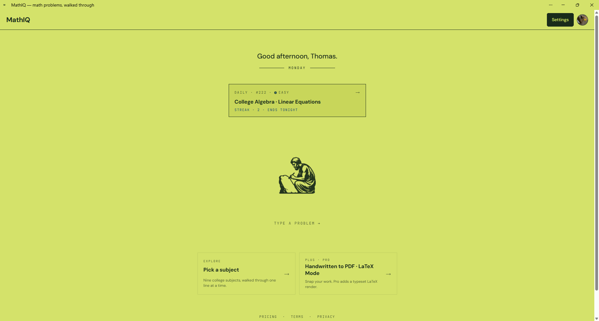

# MathIQ

Type a math problem. Walk through it. One line at a time.

A guided AI tutor for nine college math courses. Iris — the tutor —
reads your problem, picks the right technique, and walks every move out
loud. Not just the answer.

**Live**: [mathiq.io](https://mathiq.io/)

---

## Reading this repo

This is the real source behind a live paid product, published so the
engineering is inspectable. It is **not** a deployable template. Running your
own copy means bringing your own Anthropic, Clerk, Stripe, Mathpix, and Resend
accounts — and the production Iris prompts live in Cloudflare secrets, so a
fresh clone falls back to the deliberately generic prompts in
[`worker/src/prompt.ts`](worker/src/prompt.ts). It will work; it won't sound
like Iris.

- **[Full REST reference → `docs/API.md`](docs/API.md)** — all 32 endpoints.
- **[LICENSE](LICENSE)** — source-available, all rights reserved. Read it
  before forking.
- Not accepting pull requests.

---

## Contents

- [What it is](#what-it-is)
- [How a walkthrough actually works](#how-a-walkthrough-actually-works)
- [API surface](#api-surface)
- [The secret sauce — prompt engineering](#the-secret-sauce--prompt-engineering)
- [How the API calls help each other](#how-the-api-calls-help-each-other)
  - [LaTeX Mode — your work, beautifully typeset](#latex-mode--your-work-beautifully-typeset)
- [Where the secrets live](#where-the-secrets-live)
- [Stack](#stack)
- [Quickstart (local)](#quickstart-local)
- [Testing](#testing)
- [Project structure](#project-structure)
- [Architecture notes](#architecture-notes)
- [Security & privacy posture](#security--privacy-posture)
- [Deployment](#deployment)
- [License](#license)

---

## What it is



*One question on landing: what do you want to learn today?*

Nine courses, 108 topics, four tiers:

- **Anonymous** — 1 walkthrough/day on Haiku 4.5. No sign-up.
- **Free** — 3/day on Haiku 4.5. Email magic link, no password. Plus a
  one-time taste of every paid feature (see
  [lifetime trials](#lifetime-feature-trials)).
- **MathIQ+** ($7.99/mo · $5.99/mo annual · $25.99 semester) — 25/day:
  5 on Opus 4.6, then 20 on Sonnet 4.6, plus a 100-Opus-per-month
  ceiling. Photo input, why-how on any step, 90-day history with PDF
  export, Handwritten to PDF. Monthly and annual ship with a 7-day
  card-on-file trial.
- **MathIQ Pro** ($12.99/mo · $9.99/mo annual · $41.99 semester) — 38/day:
  8 on Opus 4.6, then 30 on Sonnet 4.6, plus a 150-Opus-per-month
  ceiling. LaTeX Mode (Computer Modern typeset PDFs), Exam Mode
  (generated 10–15-problem exams, capped at 2 generations/day), exam
  grading from a handwritten photo. Everything in Plus.

Every answer is verified by a separate model before the badge says
"verified." Photos of textbook problems get read straight to LaTeX and walked
through. Handwritten work goes through Mathpix. There's a **Daily Challenge**
at [`/daily`](https://mathiq.io/daily) — one problem a day, free for everyone
including anonymous visitors, with Wordle-style streaks and shareable results.
The landing page rotates a different ancient-Greek scribe and tagline by day
of week.


*Nine courses. Pick one, type a problem, walk through it.*

---

## How a walkthrough actually works

The streaming endpoint is the heart of the product. Every visible
behavior — daily caps, model selection, the live token stream, the
"verified" badge — comes out of this one request flow.


*Every step is numbered, rendered in KaTeX, and expandable into the
strategic reasoning behind the move. The usage pill tracks the daily
allowance and names the model that actually served the request.*

```
  CLIENT                  WORKER                       UPSTREAM (Claude)
  ──────                  ──────                       ─────────────────

  POST /api/walkthrough ─►  ① Clerk JWT verify
                            ② resolveTier()  ─KV read─►   subscription
                            ③ peek counters  ─DO read─►   today + this month
                            ④ decideTier()   → model? Opus / Sonnet / Haiku / null
                            ⑤ inc counter    ─DO write─►  atomic ++
                            ⑥ claim Opus     ─DO write─►  monthly ceiling
                            ⑦ stream call    ────────────►  Anthropic
                            ⑧ pipe through normalizeLatexDelimiters
  ◄── text chunks ───────   ⑨ on disconnect: abort upstream
                            ⑩ if 5xx: dec counters (refund)
```

Every numbered step lives in `worker/src/`:

1. **Auth** (`auth.ts`) — Clerk JWT verified by `@clerk/backend` with
   `authorizedParties` pinned to the CORS allowlist. No session storage;
   tokens are checked per request. Note the three-way result: *no*
   `Authorization` header is anonymous (fine), a *broken* one is a 401.
2. **Tier resolution** (`tier.ts::resolveTier`) — `MAX_USER_IDS` env
   override (Pro) → `PRO_USER_IDS` env override (Plus) → Stripe
   subscription state in KV → one-time semester pass in KV → free.
3. **Atomic peek** (`rateLimit.ts` → `counterDO.ts`) — each
   `(userId, UTC date)` pair gets its own Durable Object actor, and paid
   users carry a second `(userId, UTC month)` actor for Opus. Peek
   is a no-mutation read.
4. **Tier decision** (`tier.ts::decideTier`) — given today's count and this
   month's Opus count, returns the *model to use for this request*:

   | Tier | Ceiling | Opus | Then | Opus/month |
   |---|---|---|---|---|
   | Anonymous | 1/day | — | Haiku 4.5 | — |
   | Free | 3/day | — | Haiku 4.5 | — |
   | Plus | 25/day | first 5 | Sonnet 4.6 | 100 |
   | Pro | 38/day | first 8 | Sonnet 4.6 | 150 |

   Nobody gets Opus for their whole allowance. Both paid tiers spend their
   premium budget early in the day and finish on Sonnet — which is the point:
   the hard problem you open the app for lands on Opus, the routine ones after
   it don't need to.
5. **Atomic increment** — single-threaded DO mutation. Race-proof: two
   concurrent requests that both peek `count=24` will get *different*
   post-increment values back, and the loser is refunded and 429'd.
6. **Monthly Opus claim** — when the decision says Opus, a second atomic
   claim runs against the monthly ceiling. If that ceiling is already full,
   the claim is refunded and the request is quietly downgraded to Sonnet with
   `X-Degraded: true`. The daily slot still counts — the user gets their
   walkthrough, just on the fallback model. A single heavy user can't burn a
   year of margin in one month.
7. **Stream dispatch** (`anthropic.ts`) — system prompt + course/topic context
   + format reinforcer; everything before the user message marked
   `cache_control: ephemeral` so the 5-minute prompt cache kicks in.
8. **Inline normalization** (`normalize.ts::normalizeLatexDelimiters`)
   — a `TransformStream` that rewrites `\(…\)` → `$…$` and `\[…\]` →
   `$$…$$` mid-flight. Chunk-safe (holds a trailing backslash across
   chunk boundaries). Without this, Haiku occasionally drifts into the
   wrong delimiter style and KaTeX gives up halfway through a stream.
9. **Abort on disconnect** — when the client cancels (e.g. user
   navigates away), the worker calls `reader.cancel()`, which closes
   the upstream connection and stops the model generating tokens
   nobody will see.
10. **Refund on upstream failure** — if the upstream returns 5xx after
    the counters were already incremented, the worker calls `/dec` on the
    DOs so the user isn't charged for an empty stream.

The response also carries `cache-control: no-store, no-transform` and
`content-encoding: identity`. Both are load-bearing: without them Cloudflare's
edge gzips the stream, which buffers chunks and defeats the client's live step
parser. The stream stops feeling live and starts arriving in lumps.

After the response, the client (optionally) calls **`/api/verify`** —
a tiny Sonnet call (≤ 200 tokens) that classifies the answer as
`CORRECT` / `INCORRECT: <reason>` / `UNCLEAR`. Only when it returns
CORRECT does the green badge appear.

---

## API surface

32 endpoints, one Cloudflare Worker, no REST framework — `worker/src/index.ts`
is a flat table of `method + pathname` checks falling through to a 404.

**Full request/response reference, including every error shape and every
counter each endpoint claims → [`docs/API.md`](docs/API.md).**

| Endpoint | Method | Auth | Tier | Purpose |
|---|---|---|---|---|
| `/api/health` | GET | — | — | Dependency probe — 200 healthy, 503 degraded |
| `/api/walkthrough` | POST | optional | all | Stream a walkthrough, why-how, or practice problem |
| `/api/classify` | POST | optional | all | Free text → `(courseId, topicId)` |
| `/api/billing/state` | GET | required | all | Current plan, interval, renewal date |
| `/api/billing/checkout` | POST | required | all | Create a Stripe Checkout session |
| `/api/billing/portal` | POST | required | subscriber | Create a Customer Portal session |
| `/api/stripe/webhook` | POST | signature | — | Sync subscription + pass state from Stripe |
| `/api/trials` | GET | required | all | Remaining lifetime feature trials |
| `/api/history/save` | POST | required | all | Persist a finished walkthrough |
| `/api/history/list` | GET | required | all | Paginated history index |
| `/api/history/get` | GET | required | all | One full walkthrough |
| `/api/history/delete` | POST | required | all | Remove a walkthrough |
| `/api/ocr` | POST | required | plus \| trial | Photo → problem text (Claude vision) |
| `/api/verify` | POST | optional | all | Second-model answer check |
| `/api/exam/generate` | POST | required | pro \| trial | Generate a 10–15-problem exam |
| `/api/exam/grade` | POST | required | pro \| trial | Grade a handwritten attempt |
| `/api/exam/list` | GET | required | pro | Exams for this user |
| `/api/exam/get` | GET | required | pro | One exam + its grade |
| `/api/homework/transcribe` | POST | required | plus \| trial | Handwriting → cleaned MMD |
| `/api/homework/latex-pdf` | POST | required | pro \| trial | MMD → Computer Modern PDF |
| `/api/homework/update` | POST | required | plus | Save an edited transcription |
| `/api/homework/list` | GET | required | plus | Transcriptions for this user |
| `/api/homework/get` | GET | required | plus | One transcription |
| `/api/challenge/today` | GET | — | — | Today's Daily Challenge |
| `/api/challenge/grade` | POST | optional | all | Grade a challenge attempt |
| `/api/challenge/latex` | POST | required | all | Render your attempt as a PDF |
| `/api/streak` | GET | required | all | Current streak + freezes |
| `/api/share/:shareId` | GET | — | — | Public read of a shared attempt |
| `/api/email/unsubscribe` | GET, POST | token | — | One-click reminder unsubscribe |
| `/api/admin/cache-stats` | GET | admin | — | Daily prompt-cache hit ratio |
| `/api/admin/run-reminders` | POST | admin | — | Trigger the reminder cron by hand |
| `/api/admin/reset-daily-counters` | POST | admin | — | Reset own challenge counters |

"trial" means a signed-in Free user can spend one of their lifetime trials
instead of upgrading. "admin" means a valid Clerk session *and* membership in
`MAX_USER_IDS`.

---

## The secret sauce — prompt engineering

**The foundation prompt is ~19 KB** and is split across **four worker
secrets** (`IRIS_FOUNDATION_PROMPT_1` through `_4`). The split is a
deploy-time convenience: Cloudflare caps a single secret at ~5 KB. They
reassemble at startup into the system prompt that defines Iris — the
tutor's voice, the "Step N." cadence, the algebraic hygiene rules, the
domain-specific heuristics (integration tricks, series convergence
tests, linear-algebra simplifications), and the strict
`$…$` / `$$…$$` LaTeX delimiter contract.

Layered on top of the foundation, just before the user message, sits a
**`FORMAT_REINFORCEMENT` block** (`prompt.ts`) — a short, priority
instruction set that the model reads last and therefore obeys hardest:

- The only acceptable closing is `**Answer:**` then `*Trigger to
  remember:*`. Anything else costs the verified badge — `/api/verify`
  literally greps for the `**Answer:**` token before it will spend a call.
- No markdown tables. Use LaTeX matrices instead. This stops Sonnet
  from emitting `|column|column|` formats that break inside KaTeX.
- The format reinforcer is the *closest* string to the user message, so
  it wins any conflict with the foundation's softer guidance.

The other tutor prompts compose on top of the same foundation:

| Prompt | When | What it changes |
|---|---|---|
| `WHY_HOW_FALLBACK` | tap any step | "Why we did this" + "How it works" — 2-4 paragraphs, no step replay |
| `PRACTICE_FALLBACK` | tap "Practice" | Generates a *new* problem of the same shape & difficulty |
| `EXAM_SYSTEM_PROMPT` | exam generation | JSON schema only, 70 % routine / 25 % mid / 5 % hard, no hints |
| `CLEANUP_PROMPT` | post-Mathpix OCR | Silent typo fixes; uncertain edits surfaced as inline "did you mean…?" |
| `GRADE_FALLBACK` | exam grading | 0-10 per problem, partial credit, single-clause feedback |
| `CLASSIFIER_SYSTEM_PROMPT` | `/api/classify` | "what *kind* of problem is this?" → `(courseId, topicId)` |
| `GRADE_SYSTEM_PROMPT` | daily challenge | Answer-first grading — full marks for a right answer with no work shown |

**Each tutor prompt has a fallback in `prompt.ts` and an override via
worker secret.** That lets us iterate on the actual prompts in
production without re-deploying code, while the repo holds a working
version that ships if someone clones it without the secrets.

**Prompt caching.** The classifier's catalog (course list + topic
descriptions) is marked `cache_control: ephemeral`. First call pays
full input cost; subsequent calls within 5 minutes get ~90 % off on
the cached prefix. The walkthrough endpoint does the same with the
foundation + course/topic context block.

That discount is load-bearing for margins, which is why the hit ratio is
instrumented rather than assumed — see
[prompt-cache metrics](#prompt-cache-metrics-are-instrumented-not-assumed).

---

## How the API calls help each other

The interesting part isn't any single endpoint — it's how a handful of
specialized calls combine to deliver one user-visible feature.

**Photo of a textbook problem → walkthrough.** The user snaps a
picture in the scanner. The client posts to **`/api/ocr`**, which hands the
image to **Sonnet 4.6 vision** with a system prompt that says: output the
problem statement, in LaTeX, and nothing else — no answer, no commentary. That
text becomes the *problem* fed into `/api/classify`, whose `(courseId,
topicId)` result is fed into `/api/walkthrough`. Three calls, one button.

Printed math goes to the model rather than a dedicated OCR service on
purpose: a textbook page is clean enough that the win is in *understanding*
the notation, and the model that will solve the problem is the one best
placed to read it. Handwriting is the opposite case, which is why it goes
somewhere else entirely.

**Handwritten homework → typed PDF.** The Pro feature shown on the
pricing page goes through three models:

```
   image  ──►  Mathpix OCR  ──►  raw MMD
                                   │
                                   ▼
              Sonnet 4.6 cleanup pass  ──►  cleaned MMD
              (sees image + raw MMD)        + uncertainty flags
                                   │
              user inline-resolves uncertainty
                                   │
                                   ▼
              Sonnet 4.6 md→LaTeX  ──►  .tex  (fallback: hand-rolled mmdToTex)
                                   │
                                   ▼
              TeXLive.net compile   ──►  PDF (Computer Modern)
```

The cleanup pass is the secret. Mathpix is great at recognizing
strokes but doesn't know that an `=` sign on the third line of an
algebra step is *probably* a `−`. Sonnet — given the original image
*and* the raw MMD — applies confident operator-flip fixes silently and
flags the uncertain ones for the user to resolve.

The LaTeX step has two paths. Sonnet writing the `.tex` directly produces
proper `enumerate`/`section` environments and reads as if a human typeset it;
the hand-rolled `mmdToTex` + `wrapTexSource` is the fallback when that call
fails. The user is only charged a slot when the Claude path actually ran — the
fallback costs nothing upstream, so it costs nothing downstream.

### LaTeX Mode — your work, beautifully typeset

The point of the pipeline above, end to end. Photograph a page of
handwriting; get back real Computer Modern LaTeX. The transcription is
deliberately *faithful* rather than corrected — every step is preserved
exactly as it was written, wrong turns included. We typeset your work; we
don't grade it or fix it.

| Before — handwritten | After — Computer Modern LaTeX |
|---|---|
|  |  |

Note the generating-function result carried across untouched —
`b₁₇ = 28,603,508,759` in both — with the `\section` structure and display
math rebuilt around it.

**Exam grading.** Same two-pass shape, with a twist:

```
  handwritten attempt  ──►  Mathpix OCR  ──►  raw transcript
                                                  │
                                                  ▼
  original problems + transcript  ──►  Opus grader  ──►  JSON
                                       (per-problem 0-10, partial credit)
```

The grader sees both the *original generated problems* (so it knows what
the correct answer should be) and the *student's transcribed work*
(so it can give partial credit). Splitting OCR from grading removes the
"model auto-corrects what it sees" failure mode — Mathpix has no math priors
and transcribes exactly what's on the page, so the grader marks what the
student actually wrote, not a charitable reading of it. The output is a
structured JSON the client renders as a per-problem rubric.

**Daily Challenge.** Two models with opposite jobs:

```
  00:00 UTC, first visitor  ──►  Opus generates one problem  ──►  KV (7-day TTL)
                                 (day-of-week difficulty,
                                  clamped per course)
                                          │
  student submits (typed or photo)        │
          │                               ▼
          ├─ photo ──► Mathpix ──►┐
          └─ typed ──────────────►├──► Sonnet grades vs canonical answer
                                  │     (answer-first: full marks for a
                                  │      right answer with no work shown)
                                  ▼
                         grade + streak + shareId
```

Only the first visitor of the day pays for generation; everyone after reads
KV. Grading is answer-first by design — this is a Wordle-shaped daily habit,
not an exam, and marking someone down for not showing work would kill the
habit.

**Why this is fun to look at.** Every multi-call feature is a small
orchestra: a cheap classifier hands off to a streaming generator, a
fast vision model hands off to a deeper reasoner, an answer-generator
hands off to a separate verifier, a stroke-recognizer hands off to a
grader. Each model is doing what it's cheapest at. No single 300-token
mega-prompt tries to do everything.

---

## Where the secrets live

Everything that could be expensive if leaked is set via
`wrangler secret put`. Everything else lives in `worker/wrangler.toml`
where you can read it in the git history.

| Secret | What breaks if missing |
|---|---|
| `ANTHROPIC_API_KEY` | All tutoring features |
| `CLERK_SECRET_KEY` | All auth (401 every endpoint) |
| `STRIPE_SECRET_KEY` | Billing — checkout & customer portal |
| `STRIPE_WEBHOOK_SECRET` | Webhook signature verification |
| `MATHPIX_APP_ID` + `MATHPIX_APP_KEY` | Handwriting OCR (homework, exam grading, challenge photos) — those endpoints 503 |
| `OPENROUTER_API_KEY` | Nothing today — see the note below |
| `TURNSTILE_SECRET_KEY` | Anonymous challenge grading runs unverified (logged as a warning) |
| `RESEND_API_KEY` | Streak reminder emails; the cron skips silently |
| `IRIS_FOUNDATION_PROMPT_{1..4}` | Iris's voice + format rules (falls back to a generic in-repo prompt) |
| `IRIS_WHY_HOW_PROMPT` | The why/how reflection prompt |
| `IRIS_PRACTICE_PROMPT` | The practice-problem prompt |
| `IRIS_GRADE_PROMPT` + `_2` | Exam grading prompt (2-part) |

Missing optional credentials degrade rather than crash. No Turnstile means
anonymous grading still works (behind its per-IP and global caps) with a
warning logged. No Resend means the nightly cron runs, counts who *would* have
been mailed, and sends nothing.

The Iris prompts are split into multiple secrets because Cloudflare
caps each secret around 5 KB. The worker concatenates them at startup
into a single system message.

> **On OpenRouter.** `worker/src/openrouter.ts` implements a full streaming
> DeepSeek path and `ModelKey` carries an `openrouter` variant, but
> `decideTier` never returns one — nothing routes there today. It's a
> provider-neutral escape hatch kept warm in case Anthropic capacity ever
> becomes a problem, not a live fallback. Described accurately here because
> "we have a fallback provider" would be a lie.

Public, committed to `wrangler.toml`:

- `ALLOWED_ORIGINS` — CORS allowlist (mathiq.io + localhost ports for dev)
- `CLERK_PUBLISHABLE_KEY` — designed to be client-visible
- `STRIPE_PRICE_*` — six live price IDs, plus six `_OLD` grandfathered slots
- `STRIPE_SUCCESS_URL` / `_CANCEL_URL` / `_PORTAL_RETURN_URL`
- `REMINDER_FROM_EMAIL`, `WORKER_PUBLIC_URL`
- `MAX_USER_IDS` / `PRO_USER_IDS` — comp / dev override list for paid tiers

The split between "secret" and "public" is intentional. API keys, the
webhook-signing secret, and the tutor prompts are secret. Everything the user
could read by inspecting network traffic is in plain `wrangler.toml` — and so
are the Stripe price IDs, which are inert without the secret key: knowing a
`price_…` lets you do exactly nothing. `MAX_USER_IDS` is an allowlist, not a
credential; an admin endpoint still demands a valid Clerk session for *that*
user.

**The `_OLD` price slots** are the interesting part. When prices are reshaped,
the previous IDs move into `STRIPE_PRICE_*_OLD` rather than being deleted, and
`priceIdToTierInterval` resolves both sets. Existing subscribers renew on a
retired price; without the grandfathered slots their renewal webhook would
fail to map to a tier and silently downgrade them to free.

---

## Stack

| Layer | What |
|---|---|
| Frontend | React 18 + Vite 5 + TypeScript, deployed on Vercel |
| Worker | Cloudflare Worker (TypeScript) for auth, AI streaming, OCR, history, billing, challenge, email |
| State | Cloudflare KV (subscription, history, exams, challenge, share, trials, metrics) + Durable Objects (atomic rate-limit counters) |
| AI | Anthropic Claude — Opus 4.6 (premium), Sonnet 4.6 (fallback + verify + OCR + grading), Haiku 4.5 (free tiers) |
| OCR | Mathpix (math-aware) for handwriting; Claude vision for printed-problem photos |
| LaTeX | TeXLive.net for cloud-side Computer Modern typesetting |
| Auth | Clerk (email magic link, no passwords) |
| Billing | Stripe Checkout + Customer Portal + Webhooks |
| Email | Resend, with RFC 8058 one-click unsubscribe |
| Abuse | Cloudflare Turnstile on anonymous challenge grading |
| Math rendering | KaTeX + remark-math via react-markdown |
| Analytics | Vercel Web Analytics (cookieless aggregate counter) |
| Fonts | DM Sans + JetBrains Mono |

No global state library. Routes are a discriminated union; the App's
render is an exhaustive switch. Screens behind real URLs are lazy-loaded
behind a `Suspense` skeleton.

---

## Quickstart (local)

```bash
# Frontend
npm install
npm run dev          # Vite on :5173

# Worker (separate terminal)
cd worker
npm install
npx wrangler dev     # :8787

# Webhook forwarder (third terminal, only when testing billing)
stripe listen --forward-to http://localhost:8787/api/stripe/webhook
```

You'll need `.env` (frontend — see [`.env.example`](.env.example)) and
`worker/.dev.vars`, which is the local stand-in for the secrets table above:

```
ANTHROPIC_API_KEY=sk-ant-...
CLERK_SECRET_KEY=sk_test_...
STRIPE_SECRET_KEY=sk_test_...
STRIPE_WEBHOOK_SECRET=whsec_...
MATHPIX_APP_ID=...
MATHPIX_APP_KEY=...
# optional — omit and those paths degrade gracefully
TURNSTILE_SECRET_KEY=...
RESEND_API_KEY=re_...
# optional — omit and Iris uses the generic prompts in prompt.ts
IRIS_FOUNDATION_PROMPT_1=...
```

Only `ANTHROPIC_API_KEY` and `CLERK_SECRET_KEY` are needed to get a
walkthrough streaming locally. Everything else gates a specific feature and
fails with a clear 503 when absent.

Useful commands:

```bash
npm run typecheck    # tsc -b --noEmit
npm run build        # tsc -b && vite build
```

---

## Testing

The worker carries a unit suite over the logic that decides who gets what.
Pure functions only — no network, no bindings, no Cloudflare runtime — so the
whole thing runs in well under a second.

```bash
cd worker
npm test             # vitest run
npm run test:watch
```

Four files, each colocated beside what it covers:

| File | Covers |
|---|---|
| `src/tier.test.ts` | `decideTier` — daily and monthly ceilings, Opus budget exhaustion, Standard-by-choice vs. degraded-by-quota |
| `src/subscription.test.ts` | `isEntitled` across all six Stripe statuses, plus period-expiry boundaries |
| `src/stripe.test.ts` | Price-ID mapping in both directions, including the grandfathered `_OLD` slots |
| `src/rateLimit.test.ts` | UTC day and month rollovers — year boundaries, 31-day months, leap days |

The bias is toward boundaries and state transitions rather than happy paths:
the walkthrough that is one over the cap, the subscription that lapsed a
second ago, the renewal webhook carrying a retired price ID. Those are the
cases that quietly cost money or revoke a paying customer's access when they
regress.

A few tests deliberately pin behavior that is a product decision rather than
an obvious correctness rule — `past_due` revoking access with no grace
period, and total daily usage standing in for Opus usage when the caller
omits the dedicated count. They are documented as such at the test, so the
decision can't be reversed by accident.

The frontend has no tests.

---

## Project structure

```
src/
├─ main.tsx              # mounts <App>, wraps in ClerkProvider
├─ App.tsx               # real-URL check → history-aware navigation + route switch
├─ router.ts             # Route discriminated union
├─ index.css             # tokens, reveal animations, scribe-trigger hover
│
├─ design/
│  ├─ tokens.ts          # T.* references CSS vars
│  ├─ primitives.ts      # shared style objects
│  └─ icons.tsx          # geometric SVG set (no emoji in product UI)
│
├─ screens/
│  ├─ Landing.tsx        # home — daily scribe + animated search
│  ├─ Subjects.tsx       # course-picker grid
│  ├─ WalkthroughCourse.tsx  # topic list for one course
│  ├─ Topic.tsx          # the main walkthrough surface
│  ├─ DailyChallenge.tsx # /daily — one problem a day, streaks, share
│  ├─ Share.tsx          # /share/:id — public read of someone's attempt
│  ├─ Homework.tsx       # handwritten → MMD → optional LaTeX PDF
│  ├─ Exams.tsx          # exam list (Pro)
│  ├─ ExamTake.tsx       # take a generated exam
│  ├─ ExamGrade.tsx      # upload handwritten attempt, see graded result
│  ├─ History.tsx        # past walkthroughs, grouped by day
│  ├─ Settings.tsx       # account, plan, photo upload, pace
│  ├─ Pricing.tsx        # marketing page with the LaTeX before/after demo
│  ├─ NotFound.tsx
│  └─ Terms.tsx / Privacy.tsx
│
├─ components/
│  ├─ MathMarkdown.tsx   # react-markdown + remark-math + rehype-katex
│  ├─ MarkdownBoundary.tsx  # error boundary — malformed LaTeX can't blank the page
│  ├─ TurnstileWidget.tsx   # anonymous challenge grading
│  └─ Confetti.tsx       # streak celebration (reduced-motion aware)
│
├─ scanner/
│  ├─ Scanner.tsx        # camera + library picker, multi-page bundling
│  ├─ index.ts           # imperative openScanner() entry
│  └─ scanToPdf.ts       # multi-page → jsPDF
│
├─ shell/
│  ├─ Header.tsx         # wordmark + back arrow + Settings + Clerk UserButton
│  └─ InstallPrompt.tsx  # beforeinstallprompt + iOS Safari Add-to-Home-Screen hint
│
├─ walkthroughs/
│  ├─ generate.ts        # /api/walkthrough client + RateLimitInfo
│  ├─ classify.ts        # /api/classify
│  ├─ isProblem.ts       # client-side "is this even a math problem?" pre-check
│  ├─ ocr.ts             # /api/ocr
│  ├─ verify.ts          # /api/verify
│  ├─ homework.ts        # /api/homework/*
│  ├─ exam.ts            # /api/exam/*
│  ├─ history.ts         # /api/history/*
│  ├─ tier.ts            # client-side tier types (display only — server decides)
│  ├─ types.ts
│  └─ courses.ts         # 9 courses × 12 topics catalog
│
├─ billing/
│  ├─ client.ts          # /api/billing/* fetchers
│  ├─ trials.ts          # /api/trials + per-feature lifetime trial state
│  └─ challenge.ts       # /api/challenge/* + /api/streak fetchers
│
├─ hooks/                # useAsync, useDialogFocus
├─ lib/                  # rafBatch (stream paint batching), storage (localStorage guard)
├─ state/                # dailyScribe, promptFlow, useTypedString
└─ upgrade/
   └─ UpgradePrompt.tsx  # unified upgrade modal for every gated feature

api/
└─ share-og/[shareId].ts # Vercel function — server-rendered social card for bots

worker/
└─ src/
   ├─ index.ts           # 32 routes + CORS + webhook dispatch + reminder cron
   ├─ auth.ts            # Clerk JWT verification
   ├─ courses.ts         # server-side catalog (source of truth for validation)
   ├─ prompt.ts          # tutor system prompts + fallbacks
   ├─ anthropic.ts       # streaming Anthropic call w/ caching, abort, usage capture
   ├─ openrouter.ts      # streaming OpenRouter call (wired, not routed to)
   ├─ normalize.ts       # \( → $ TransformStream for streams
   ├─ tier.ts            # resolveTier + decideTier
   ├─ rateLimit.ts       # DO-backed atomic counter wrappers
   ├─ counterDO.ts       # the UsageCounter Durable Object
   ├─ trials.ts          # lifetime per-feature trial counters
   ├─ subscription.ts    # KV CRUD: subs, semester passes, webhook idempotency
   ├─ stripe.ts          # checkout + portal + webhook verification + price mapping
   ├─ ocr.ts             # /api/ocr (photo problem → LaTeX, Claude vision)
   ├─ mathpix.ts         # Mathpix sync (images) + async (PDFs)
   ├─ cleanup.ts         # post-Mathpix cleanup pass
   ├─ verify.ts          # /api/verify (separate-model answer check)
   ├─ history.ts         # /api/history/* CRUD
   ├─ homework.ts        # homework record CRUD
   ├─ latex.ts           # md → tex → TeXLive.net PDF
   ├─ exam.ts            # exam generate + grade + list
   ├─ challenge.ts       # daily challenge generate + grade
   ├─ streak.ts          # streak state, freezes, streaker index
   ├─ share.ts           # opaque shareable attempt records
   └─ email.ts           # Resend send + unsubscribe tokens
```

---

## Architecture notes

**Routes are internal state, with browser history.** Internal
navigation is a `Route` discriminated union held in `useState`, but
every `navigate()` call pushes onto `window.history` so the browser
back button and the iOS PWA edge-swipe both work. Five paths are *real*
URLs, checked against `location.pathname` at boot before the SPA mounts:
`/terms`, `/privacy`, `/pricing`, `/daily`, and `/share/:shareId`. Those need
to survive a cold load from a tweet, an email, or a Stripe redirect. Everything
else is state.

**Rate limiting is atomic.** Each `(userId, UTC date)` pair gets a
single-threaded Durable Object. The pattern is:

```
peek → decide → inc → recheck → upstream call → (success: keep | fail: dec)
```

The "recheck after increment" step handles the race where two requests
both peeked at `count = 24`; only one of them will get `post-inc = 25`,
and the loser is refunded and 429'd. Eight distinct counter keys exist —
daily total, monthly Opus, exam generation, challenge grade, challenge LaTeX,
and the anonymous per-IP and global variants. All of them are the same DO
class with a different name.

**Subscription state lives in KV.** Stripe is the system of record; we
mirror just enough for tier resolution (`subscription:user:<userId>`
→ `{tier, interval, status, currentPeriodEnd, stripeCustomerId,
stripeSubscriptionId}`). TTL is `currentPeriodEnd + 7 days` so
canceled subs decay quickly even if the cancel webhook is missed.

**Semester passes are stored separately.** A one-time payment creates
a `pass:user:<userId>` record (`PassState`) with a 4-month expiry
computed by calendar months, not 120 days. Tier resolution checks the
subscription first and returns immediately if it's entitled — the pass is only
consulted when there's no active sub. A user holding both is served by the
subscription regardless of which tier is higher, because a live subscription
is the thing they're currently paying for.

**Webhook idempotency.** Every processed Stripe event is marked
(`stripe-event:<id>` → 24h TTL). Retries that arrive after the first
delivery are dropped.

**Streaming abort.** The worker forwards `AbortSignal` from the client
all the way into the upstream `fetch`. Closing the browser tab closes
the upstream connection mid-stream — no tokens charged for content
the user never sees.

**Tier resolution order** (`worker/src/tier.ts`):

1. `anonymous` if not signed in
2. `MAX_USER_IDS` env whitelist → `pro`
3. `PRO_USER_IDS` env whitelist → `plus` (dev override)
4. KV subscription state if `active` or `trialing`
5. KV semester pass if not expired
6. `free`

The env whitelists are intentional — they're how comp accounts get
paid-tier access without paying through Stripe.

### Lifetime feature trials

Signed-in Free users get a one-time allotment of every paid feature: 3 photo
inputs, 5 why-hows, 2 handwritten transcriptions, 1 LaTeX render, 1 exam
generation, 2 exam gradings. Counts never reset; when one hits zero the upgrade
modal fires with a `402 trial_exhausted`.

One gate function (`ensureFeatureAccess`) handles the whole matrix — Pro
passes everything, Plus passes Plus-tier features and gets an upgrade pitch on
Pro ones, Free consumes a trial, anonymous gets a sign-in prompt. Its partner
`refundAccess` gives the trial back when the upstream call fails, so a Mathpix
outage doesn't burn the one LaTeX render a user will ever get for free.

The design bet: a student who has *seen* their handwriting come back as a
typeset PDF converts far better than one who has only read about it. One use
is enough to demonstrate and not enough to finish a problem set.

### Prompt-cache metrics are instrumented, not assumed

The 90 % input discount on ephemeral cache hits is what keeps Plus and Pro
margins healthy, which makes a silent cache regression an expensive thing to
find out about late. Every walkthrough's Anthropic `usage` block is folded
into a per-day KV rollup (`metrics:cache:YYYY-MM-DD`, 90-day TTL, broken down
by model), and `GET /api/admin/cache-stats` returns the window plus a computed
`cache_hit_ratio`.

The rollup is a read-modify-write on a single key, so concurrent walkthroughs
occasionally lose a write. That's deliberate: KV has no atomic increment, the
number that matters is a ratio rather than a count, and paying Durable Object
costs to make *instrumentation* exact would invert the point of measuring it.

### Streaks and the reminder cron

The Daily Challenge tracks a Wordle-style streak with a Duolingo-style safety
net: a correct answer extends, an incorrect one breaks, missing exactly one day
auto-consumes a freeze if you have one, and missing two always breaks. Freezes
refill to 1 on the first of each UTC month. Same-day resubmission is
idempotent — first answer counts.

A `0 22 * * *` cron scans a KV index of live streakers and emails the ones
whose streak is still recoverable today. It skips anyone who already solved,
already got today's mail, has an unrecoverable gap, or unsubscribed. Sends are
idempotent per user per day, so a cron retry can't double-mail. Every message
carries an RFC 8058 one-click unsubscribe: `GET` renders a confirmation page,
`POST` returns a bare 200, which is what Gmail and Outlook require.

### CORS is an allowlist with four deliberate holes

Requests are rejected with a plain-text `403` before routing unless their
`Origin` is in `ALLOWED_ORIGINS`. Four endpoints are exempt because they're
reached from contexts that send no `Origin` at all: `/api/health` (uptime
probes), `GET /api/share/*` (link-preview bots and direct navigations),
`/api/email/unsubscribe` (third-party mail clients), and the Stripe webhook,
which is handled before the CORS block entirely and authenticated by signature
instead.

Each hole is a specific, unavoidable case rather than a general relaxation —
and each is a *read* or a signed write, never an authenticated mutation.

### Input is bounded at the edge

Every body-carrying endpoint has a size ceiling, and the upload endpoints check
`content-length` *before* `request.json()` parses anything, so an oversized
body is a cheap `413` rather than a worker held open on a 20 MB parse.
Problems cap at 8 000 chars, why-how context at 60 000, classifier input at
2 000, images at ~6 MB, PDFs at ~15 MB. Media types are an explicit allowlist,
not a prefix check.

---

## Security & privacy posture

**The server is the only source of truth for entitlement.** Every paid feature
is gated in the worker by `tier.ts` + `subscription.ts`. The client has tier
types, but only for display — it renders what the server tells it and reads a
402/403/429 to decide which upgrade prompt to show. There is no client-side
"is this user Pro?" check that isn't also enforced upstream, because clients
lie.

**Share links identify nobody.** A `shareId` is 16 random hex chars derived
from nothing, and the record it points at holds the challenge date, the
submitted work, and the grade — no user id is written on the way in or read on
the way out. An anonymous attempt and a signed-in one produce structurally
identical shares. Records expire after 7 days.

**Anonymous abuse has three layers.** Free grading for signed-out visitors is
the growth hook, so it's defended rather than removed: Cloudflare Turnstile,
a 1/day per-IP counter, and a 500/day global ceiling that caps the blast
radius when someone rotates IPs. The global cap fails closed with a 503 that
invites sign-in.

**Errors don't leak upstream detail.** Third-party failures are logged
worker-side with status and truncated detail; the client gets a short
human-readable message. Stripe webhook failures log only the event id and
type — never the payload.

**Response headers** (`vercel.json`): HSTS with `preload`,
`X-Content-Type-Options: nosniff`, `X-Frame-Options: DENY`, a
`Referrer-Policy` of `strict-origin-when-cross-origin`, a Permissions-Policy
denying camera/microphone/geolocation/FLoC, and a Content-Security-Policy
currently in **report-only** while the allowlist is validated against live
traffic. `/settings` is additionally `no-store` so plan state never sits in a
shared cache.

**Analytics are cookieless.** Vercel Web Analytics runs as an aggregate
counter — no cookies, no cross-site identifiers, no per-user profile. See
[the privacy page](https://mathiq.io/privacy).

---

## Deployment

**Worker** (Cloudflare):
```bash
cd worker
npx wrangler kv namespace create USAGE          # one-time
# paste the id into wrangler.toml

npx wrangler secret put ANTHROPIC_API_KEY
npx wrangler secret put CLERK_SECRET_KEY
npx wrangler secret put STRIPE_SECRET_KEY
npx wrangler secret put STRIPE_WEBHOOK_SECRET
npx wrangler secret put MATHPIX_APP_ID
npx wrangler secret put MATHPIX_APP_KEY
# optional — these degrade gracefully when unset
npx wrangler secret put OPENROUTER_API_KEY
npx wrangler secret put TURNSTILE_SECRET_KEY
npx wrangler secret put RESEND_API_KEY
# Iris prompts — 4-part foundation + per-action overrides
npx wrangler secret put IRIS_FOUNDATION_PROMPT_1
npx wrangler secret put IRIS_FOUNDATION_PROMPT_2
npx wrangler secret put IRIS_FOUNDATION_PROMPT_3
npx wrangler secret put IRIS_FOUNDATION_PROMPT_4
npx wrangler secret put IRIS_WHY_HOW_PROMPT
npx wrangler secret put IRIS_PRACTICE_PROMPT
npx wrangler secret put IRIS_GRADE_PROMPT
npx wrangler secret put IRIS_GRADE_PROMPT_2

npx wrangler deploy
# first deploy creates the UsageCounter DO class via the v1 migration
# and registers the 0 22 * * * reminder cron
```

**Frontend** (Vercel): connect the repo, set `VITE_WORKER_URL` and
`VITE_CLERK_PUBLISHABLE_KEY` env vars, deploy. `vercel.json` carries the SPA
rewrite, the security headers, and the crawler rewrite that serves social
cards for `/share/:id`.

**Stripe**: create products + prices in the dashboard, paste the six
`price_…` IDs into `wrangler.toml`, configure Customer Portal, add a
webhook destination at `<worker-url>/api/stripe/webhook` listening to
`checkout.session.completed` + `customer.subscription.{created,updated,deleted}`.
When prices change later, move the outgoing IDs into the `_OLD` slots first —
existing subscribers renew on them.

**Resend**: verify a sending domain (DKIM + SPF), then set
`REMINDER_FROM_EMAIL` in `wrangler.toml` to a sender on that domain.

---

## License

Source-available, all rights reserved — see [LICENSE](LICENSE). You may read,
study, and cite this code. You may not redistribute it, deploy it as a
service, or use it commercially without written permission.
